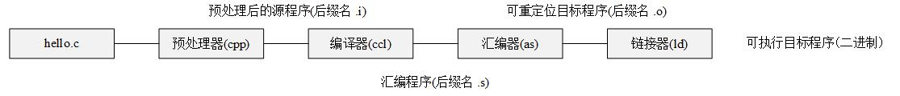

# Linux下gcc/g++的编译过程

##  文件

- 文本文件：只由ASCII字符构成的文件。
- 二进制文件：除文本文件之外的文件。

## 编译系统

- 描述了由源程序文件到目标可执行文件的过程。

  

上图即为编译系统的具体框图，需要注意的是“可重定位目标程序”和“可执行目标程序”均为二进制文件，其余皆为文本文件。
- 预处理阶段：主要完成文件包含、条件编译和宏定义与宏替换三种工作。
- 编译阶段：将hello.i文件翻译成hello.s文件，即汇编语言的文本文件。
- 汇编阶段：汇编器将hello.s文本文件翻译成机器语言指令，并打包成可重定位目标程序的格式，并将结果保存在目标文件hello.o中。
- 链接阶段：将用到的库文件以某种方式合并到hello.o文件中，最后生成可执行目标程序

## gcc/g++命令

- gcc根据后缀名.c或.cpp分别按c程序或c++程序编译
- g++则将.c或.cpp都按c++程序编译

### 预处理

~~~
g++ -E hello.c > hello.i
~~~

采用参数-E执行预处理过程，但不会生成文件，因此将其重定向到一个文件中(>覆盖重定向；>>追加重定向)

### 编译

~~~
g++ -S hello.c
~~~

参数-S生成汇编代码，并生成.s文件

### 汇编

~~~
g++ -c hello.c
~~~

参数-c生成机器代码，生成.o文件

### 链接

~~~
g++ hello.o -o hello
~~~

参数-o生成可执行文件