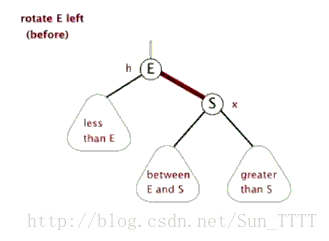

[toc]

# 红黑树定义

红黑树是一颗满足以下性质的二叉搜索树。

* (1)节点不是红色就是黑色
* (2)根节点为黑色
* (3)红色节点的孩子节点一定是黑色
* (4)从任意节点到其子孙节点的任意路径中含有相同数目的黑色节点
* (5)每个叶子节点都是黑色节点(这里的叶子节点指空节点NIL) 

# 左旋和右旋

左旋和右旋是对两个节点相对位置进行变换所进行的操作

* 左旋 ： 以当前节点为支点，将其右孩子变为其的父节点，即当前节点变成了一个左节点。

* 右旋 ： 以当前节点为支点，将其左孩子变为其的父节点，即当前节点变成了一个右节点。

由于红黑树同时是一颗二叉搜索树，因此左旋和右旋不会改变其二叉搜索树的性质。

# 节点插入

存在一颗红黑树root（可能为空）和要插入的节点node，插入新的节点后，这颗树必然还是一颗二叉树搜索树，但不一定是一颗红黑树。若node节点为黑色，则这棵树必然不满足性质(4)，因此**插入的节点都默认为红色**。这样，若node节点的父节点为黑色，则这颗树必然是红黑树，反之则必须对这颗树进行调整，使其满足红黑树的性质。得出结论：

* node节点默认为红色
* 当父节点为红色时，需要进行调整以满足红黑树的性质

下面推理父节点为祖父节点的左孩子的情况下，需要进行调整的三种情况(若为右孩子，则下面三种情况中的左旋变为右旋，右旋变为左旋)。  

首先，由于父节点为红色，则祖父节点必然是黑色，原先的root才会满足红黑树的性质。

* 祖父节点必然为黑色

然后，考虑叔父节点的颜色，**情况1：叔父节点为红色**，则叔父节点必然没有子孙节点，不然不满足性质(4)。这种情况下，将父节点和叔父节点变为黑色，祖父节点变为红色，然后以祖父节点为node节点重新进行判断。由于存在递归判断的情况，三种情况的核心思路都是**将红色的节点移到根节点；然后，将根节点设为黑色**。

* 叔父节点为红色，置父节点和叔父节点为黑色，祖父节点为红色，以祖父节点为node节点重新判断

**情况2：叔父节点为黑色，node节点为其父节点的右孩子**

* 以父节点为支点，进行左旋，变为情况3

**情况3：叔父节点为黑色，node节点为其父节点的左孩子**，原先的root中，node节点的兄弟节点必然存在且为黑色，才使得root为红黑树。将父节点变黑，则root不满足性质(4),将祖父变红，则以祖父节点到父节点的子孙节点的路径上黑色节点比祖父节点到叔父节点的子孙节点的路径上的黑色节点**多1**,为了满足性质(5)，需要以祖父节点为支点进行右旋。

* 置父节点为黑色，祖父节点置红色，以祖父节点为支点进行右旋
