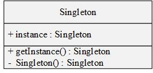
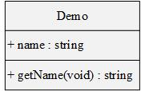

# 单例模式

单例模式是最简单的设计模式之一，单例对象的类只允许一个实例存在。

单例模式就实例的**创建时机**来划分可分为：**懒汉模式**与**饿汉模式**两种。

**饿汉模式**：应用一启动，实例就被创建，而不管何时调用该实例。**优点：**写法简单，且不需考虑多线程下实例唯一性的问题，因此运行效率高。**缺点：**由于一开始就创建，因此比较消耗系统资源。

**懒汉模式**：需要调用该实例时，才创建。**优点：**节省系统资源。缺点：在多线程下会出现实例不唯一情况，因此需要加锁解决，导致运行效率不高。

## 字段和方法的属性用+、-和#表示

- +：表示public

- -：表示private
- #：表示protected（friendly也归入这类）

其中，字段的完整表示方式如：

**属性 	名称：类型  [ = 缺省值]**

而方法的完整表示方式如：

**属性 	名称（参数列表）  [ ： 返回类型]**

## 单例模式的实现

### 1、饿汉模式

~~~c++
class Singleton   
{
private:
	static Singleton* Instance;  
private:
	Singleton(){}  
public:
	static Singleton* getInstance()
	{
		return Instance;
	}
};
Singleton* Singleton::Instance = new Singleton;
~~~

### 2、双检锁懒汉模式(double check)

~~~c++
class Singleton   
{
private:   
    static Singleton* Instance;
private:
	Singleton(){} 
public:
	static Singleton* GetInstance()
    {
		if (Instance == NULL) {//判断是否第一次调用，避免同步，降低运行效率
			Lock();
			if (Instance == NULL) {
				Instance = new Singleton;
			}
			UnLock();
		}			
		return Instance;
	}
};
~~~

### 3、改进的懒汉模式(静态内部类)

~~~c++
class Singleton   
{
private:
	Singleton() {}  
public:
	static Singleton* GetInstance()
	{
		static Singleton Instance;
		return &Instance;
	}
};
~~~

