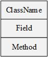
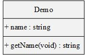
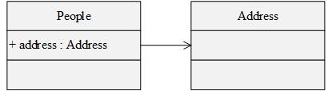
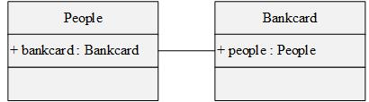
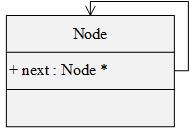
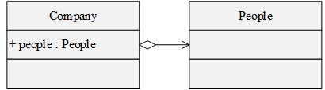
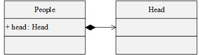
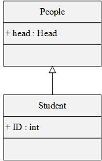
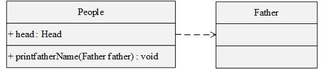
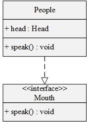

# UML类图

类图包含类名(class name)、属性或字段(field)和方法或接口(method)。

## 字段和方法的属性用+、-和#表示

- +：表示public

- -：表示private
- #：表示protected（friendly也归入这类）

其中，字段的完整表示方式如：

**属性 	名称：类型  [ = 缺省值]**

而方法的完整表示方式如：

**属性 	名称（参数列表）  [ ： 返回类型]**

## 类与类之间的关系

### 1、关联关系

关联关系分单向关联、双向关联和自关联。

#### 单向关联

单向关联为类People含有类Address类型的成员变量，用实线单向箭头表示。

#### 双向关联

双向关联为类People和类Bankcard彼此含有对方类型的成员变量，用实线表示。

#### 自关联

自关联为类Node含有自个类型的成员变量，用实线单向箭头表示。

### 2、聚合关系

聚合关系为类Company的对象可以含有类People的对象，但类People的对象不是类Company的对象的一部分。从语义上说，聚合关系强调的是“整体”包含“部分”，但是“部分”可以脱离“整体”而单独存在。从生命周期上说，“整体”和“部分”的生命周期不一致，即“整体”析构时，“部分”仍存在，而“整体”构造时，“部分”已经先被构造。聚合关系用空心菱形+实线箭头表示。

### 3、组合关系

组合关系为类People的对象含有类Head的对象，而类Head的对象不能单独存在。即“整体”和“部分”之间具有相同的生命周期，当“整体”消亡后，“部分”也将消亡。组合关系用实心菱形+实线箭头表示。

### 4、继承关系

继承关系为Student类继承了People类，继承关系用带空心三角形箭头的实线表示。

### 5、依赖关系

依赖关系为People类中的方法依赖于类Father的对象，依赖关系用虚线箭头表示。

### 6、实现关系

实现关系为接口类Mouth只定义了方法，而没有具体实现，类People实现了接口类Mouth的方法。

~~~c++
// 接口
interface Mouth {
public 
	void speak();
}

// 接口实现类
class People implements Mouth {
private 
    Head head;
public 
    void speak() {
        System.out.println("hello");
    }
}

~~~

