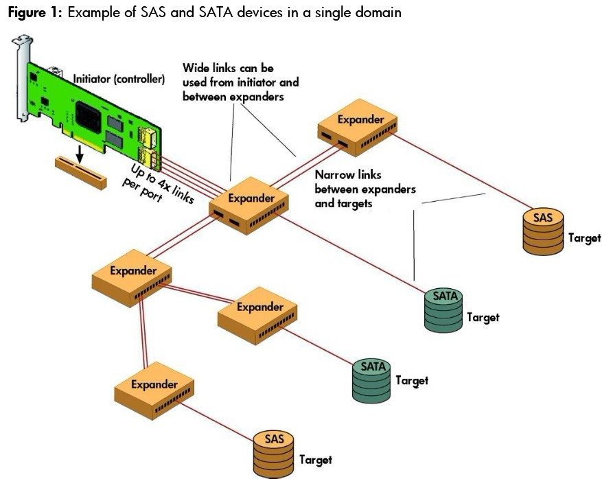

# SAS协议

SAS是Serial Attacted SCSI的简称，即串行SCSI。

## 名词定义

Domain：A set of SAS devices that communicate with one another through a service delivery subsystem
Expander ：A device that functions as a switch to attach one or more initiators to one or more targets
JBOD : A group of hard disks, usually in an enclosure, that may or may not be RAID configured
Initiator : A device containing SSP, STP, or SMP initiator ports in a SAS domain
PHY : The mechanism that connects the physical SAS layer to the SAS link layer
Physical link : Two differential signal pairs, one pair in each direction, that connect two PHYs
SAS address : The address of an initiator port, a target port, or an expander device
Serial ATA Tunneling Protocol (STP) :A SAS protocol used to communicate with SATA drives
Serial Management Protocol (SMP) : A SAS protocol used to communicate with SAS expanders
Serial SCSI Protocol (SSP) : A SAS protocol used to communicate with SAS drives
Service delivery subsystem : The part of a SAS system that sends information between a SAS initiator and a SAS target
Target : An end device such as a SAS drive, SATA drive, or SAS tape drive
Wide port : A port that contains more than one PHY
Zone group : A set of PHYs in a zone that all have the same access permission

## SAS设备

SAS共有三种设备：initiators, targets, 和 expanders。

Initiators：SAS initiators have multiple ports for connecting to internal and external targets. Each initiator port can have a single physical link (a narrow port) or two, four, or eight physical links (a wide port). You can connect SAS initiator ports to separate domains for fail-over redundancy，提到了initiator port可以有多个physical links.

Expanders：Expanders connectinitiators, targets, and other expanders. They receive commands and data in one port and route them to another port based on the SAS address of the target. Expanders use three routing methods:direct, table, and subtractive. Direct routingforwards the commands and data to targets directly attached to the expander.Table routingforwards the commands and data to another expander. When an expander receives a SAS address that it does not recognize, it uses subtractive routing to forward the commands and data to another expander that recognizes the address. Each routing method uses routing tables that are maintained in each expander. The expander creates the routing table during the discovery processknown as self-configuration. expander在系统中的位置是：承上启下，用来连接Initiator和target，expander作用类似于路由器，根据target的SAS地址来路由数据和命令。其中expander具有三种路由方式：direct, table和 subtractive.

Targets :SAS drives (both enterprise-class and midline) have two narrow ports. SAS drives use the same electrical and physical connection interface as SATA drives. However, SATA drives have a single narrow port. You can have SAS and SATA devices in a single domain. The size of the expanders’ routing tables determines how many initiators and targets you can have in a domain.

