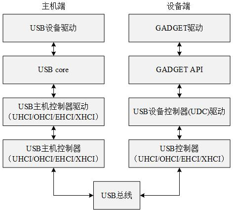

[TOC]

# USB驱动

## 1、usb驱动架构

USB驱动支持两种主要类型的USB驱动程序：

（1）主机端(host)驱动程序；

（2）设备(device)驱动程序。

其中，主机端驱动程序控制插入其中的USB设备，而设备驱动程序则控制设备作为一个USB设备和主机通信。另外，由于**USB设备驱动程序**极易与**主机端的USB设备驱动**混淆，USB开发者创建了术语**USB器件驱动程序**(USB gadget drivers)来描述控制连接到计算机的USB的设备驱动程序。

## 2、主机端驱动程序

- 主机端驱动程序按层次机构分为：

  - （1）USB主机控制器硬件底层；

  - （2）USB主机控制器驱动；

  - （3）USB核心；

  - （4）USB设备驱动。

其中，（1）由专门的设备厂商提供，一般SOC均集成了USB主机控制器；（2）一般由生产USB主机控制器的厂商提供；（3）USB核心由linux内核负责；（4）USB设备驱动由设备厂商提供(如打印机)。因此，一般在主机端需要完成的是**USB主控制器驱动**和**USB设备驱动**。

- 功能描述：
  - （1）USB主机控制器硬件负责USB通信的硬件实现；
  - （2）USB主机控制器驱动负责控制插入USB总线的USB设备，代码位于driver/usb/host；
  - （3）usb核心向上为设备驱动提供编程接口，向下为usb控制器驱动提供编程接口，维护整个usb设备信息，完成设备热插拔控制，总线数据传输控制。核心层代码位于driver/usb/core；
  - （4）USB设备驱动负责驱动具体的设备，如鼠标等。具体代码根据具体的设备放在对应目录下。

### 1、USB主控制器驱动

usb主控制器是在主机端负责与usb设备通信的设备，CPU将要传输的信息和对象给到主控制器，主控制器完成通信后再将获得的信息交给主控制器。而主控制器驱动则按照指定的USB标准驱动usb主控制器与usb设备进行通信。

~~~c
#define module_platform_driver(__platform_driver) \
    module_driver(__platform_driver, platform_driver_register, \
            platform_driver_unregister)

#define module_driver(__driver, __register, __unregister, ...) \
static int __init __driver##_init(void) \
{ \
    return __register(&(__driver) , ##__VA_ARGS__); \
} \
module_init(__driver##_init); \
static void __exit __driver##_exit(void) \
{ \
    __unregister(&(__driver) , ##__VA_ARGS__); \
} \
module_exit(__driver##_exit);

~~~

### 2、USB设备驱动

## URB

USB请求块（USB Request Block，URB）