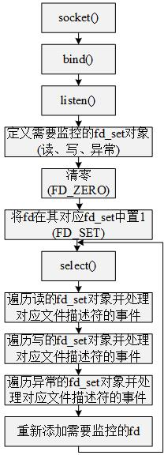

# IO复用

IO复用是IO模型之一，是一个线程监听多个IO的解决方案。

linux中有以下三种IO复用模型：

- select
- poll
- epoll

## select

头文件：

~~~c
#include<sys/select.h>
#include<sys/time.h>
#include<sys/types.h>
#include<unistd.h>
~~~

函数：

~~~c
int select(int nfds, fd_set *readfds,fd_set *writefds, fd_set *exceptfds, struct timeval *timeout);
~~~

功能：允许一个线程监控多个文件描述符。

参数：

- nfds 监控的文件描述符中最大值加1

- readfds 一个fd_set类型的指针，指向一个可读文件描述符集合(bit-set)，集合中需要监控的文件描述符的位设置为1。

- writefds 一个fd_set类型的指针，指向一个可写文件描述符集合(bit-set)，集合中需要监控的文件描述符的位设置为1。

- exceptfds 一个fd_set类型的指针，指向一个意外文件描述符集合(bit-set)，集合中需要监控的文件描述符的位设置为1。

- timeout 一个timeval类型的指针，timeval的定义如下，timeout用于设置select函数的阻塞时间，若tv_sec和tv_usec都为0则select函数会立即返回；若timeout为NULL则会一直阻塞，直到文件描述符就绪。**每执行一次，timeout的值需重新设置**。

  ~~~c
  struct timeval
  {
      long tv_val;//秒数
      long tv_usec;//微妙数
  }
  ~~~

返回：

- -1 发生错误，并设置errno。
- n 状态发生改变的文件描述符数量。

常用宏：

~~~c
int FD_ZERO(int fd, fd_set *fdset); //fd_set类型变量的所有位都置0
int FD_CLR(int fd, fd_set *fdset);  //fd_set类型变量中fd对应的位置0
int FD_SET(int fd, fd_set *fd_set); //fd_set类型变量中fd对应的位置1
int FD_ISSET(int fd, fd_set *fdset);//fd_set类型变量中fd对应的位是否为1
~~~

**注意事项：**  

- select函数中fd_set类型的参数，在函数执行完成后，只有状态发生改变的文件描述符对应的位仍为1。例如：

  ~~~c
  fd_set reads;
  FD_ZERO(&reads);
  //需监控文件描述符fd1 = 2和fd2 = 3
  FD_SET(fd1, &reads);
  FD_SET(fd2, &reads);
  
  int ret = select(fd2+1,&reads,NULL,NULL,NULL);
  //若只有fd2的状态发生改变
  FD_ISSET(fd1, &reads);//返回0，即reads中fd1对应的位为0
  FD_ISSET(fd2, &reads);//返回1，即reads中fd2对应的位为1
  ~~~

常用流程：



[回声服务器示例](./select_example/README.md)

## poll

头文件：

~~~c
#include<poll.h>
~~~

函数：

~~~c
int poll(struct pollfd *fds, nfds_t nfds, int timeout);
~~~

功能：允许一个线程监控多个文件描述符。

参数：

- fds 是一个pollfd类型的指针对象

  ~~~c
  struct pollfd {
      int fd;//文件描述符
      short events;//监控的事件，按位或
      short revents;//由内核控制，告知fd上哪些监控的事件发生了
  }
  ~~~

- nfds 指针fds指向的数组中，struct pollfd元素的数量

- timeout 为poll的超时时间(单位是ms)，-1表示会一直阻塞，直到事件发生。

返回：

- -1 发生错误，并设置errno
- 0 等待超时

[回声服务器示例](./poll_example/README.md)

## epoll

epoll是通过一组函数来完成监听多个文件描述符的任务。

### 1、创建epoll文件描述符

头文件：

~~~c
#include<sys/epoll.h>
~~~

函数：

~~~c
int epoll_create(int size);
~~~

功能：创建一个epoll实例，并返回一个文件描述符，来唯一标识存放于内核中的事件表，事件表存放需要监控的事件。

参数：

- size 参数现在不起作用

### 2、控制epoll实例

头文件：

```c
#include<sys/epoll.h>
```

函数：

```c
int epoll_ctl(int epfd, int op,int fd, struct epoll_event *event);
```

功能：对epfd指向的epoll实例进行控制。

参数：

- epfd 函数epoll_create()创建的文件描述符。

- op 指定操作类型：

  - EPOLL_CTL_ADD 往事件表中注册fd上的事件
  - EPOLL_CTL_MOD 修改fd上的注册事件
  - EPOLL_CTL_DEL 删除fd上的注册事件

- event 是epoll_event类型的指针，用于指定事件，epoll_event定义如下

  ~~~c
  struct epoll_event{
    uint32_t events;  //Epoll事件
    epoll_data_t data;//用户数据
  };
  typedef union epoll_data{
      void    *ptr;
      int       fd;
      uint32_t u32;
      uint64_t u64;
  };
  ~~~

返回：

- 0 执行成功
- -1 失败并设置errno

### 3、等待事件发生

头文件：

```c
#include<sys/epoll.h>
```

函数：

```c
int epoll_wait(int epfd, struct epoll_event *events, int maxevents, int timeout);
```

功能：在超时时间内，等待一组文件描述符上的事件发生。

参数：

- epfd 函数epoll_create()创建的文件描述符。
- events 是epoll_event类型的指针，如果函数检测到事件，则将所有就绪事件复制到events所指向的数组中。
- maxevents 最多监听多少事件。
- timeout 为epoll的超时时间(单位是ms)，-1表示会一直阻塞，直到事件发生。

返回：

- 0 执行成功
- -1 失败并设置errno

[回声服务器示例](./epoll_example/README.md)

