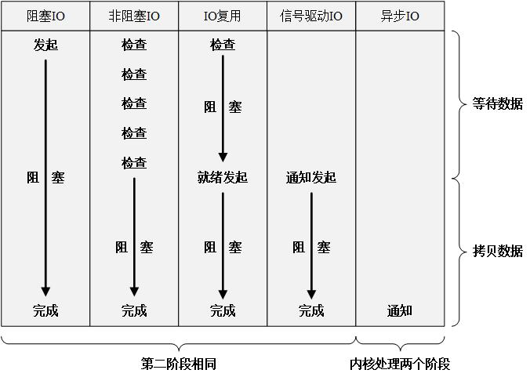

# 同步、异步、阻塞、非阻塞

## 定义

网络IO中，涉及**两个对象**，1、调用IO的进程或线程(用户态);2、系统内核(内核态)。本文采用IO操作中的read操作来对同步、异步、阻塞和非阻塞概念进行说明。read操作会经历**两个阶段**，1、等待数据就绪(内核态中有数据可读)；2、将数据从内核态中的内存拷贝到用户态的内存中。

- 同步：在第二阶段**会**导致用户态进程阻塞，直至第二阶段完成。因此**阻塞IO**、**非阻塞IO**、**IO复用**和**信号驱动IO**都属于同步IO。
- 异步：在第二阶段**不会**导致用户态进程阻塞。
  - **同步和异步的核心区别**：真正的IO操作，即第二阶段会不会阻塞用户态进程。异步IO会在第二阶段完成后由内核通知用户态进程，即第一和第二阶段用户态进程都不会阻塞。  

阻塞和非阻塞关注的是**程序(进程/线程)** 在等待调用结果时的状态。
- 阻塞：当正在执行的进程/线程，由于系统资源未就位，使自己的运行状态变为阻塞状态。  
- 非阻塞：当正在执行的进程/线程，虽然系统资源未就位，但自己的运行状态不会变为阻塞状态。 

## 同步、异步、阻塞、非阻塞的3个层次
1、CPU层次；  
2、线程层次；  
3、程序员感知层次。  

### CPU层次
说操作系统进行IO和任务调度的层次，现代操作系统通常使用异步非阻塞方式进行IO（有少部分IO可能会使用同步非阻塞轮询），即发出IO请求之后，并不等待IO操作完成，而是继续执行下面的指令（非阻塞），IO操作和CPU指令互不干扰（异步），最后通过中断的方式来通知IO操作完成结果。
### 线程层次
线程层次或者说操作系统调度单元的层次，操作系统为了减轻程序员的思考负担，将底层的异步非阻塞的IO方式进行封装，把相关系统调用（如read，write等）以同步的方式展现出来。然而，同步阻塞的IO会使线程挂起，同步非阻塞的IO会消耗CPU资源在轮询上。为了解决这一问题，就有3种思路：  

1、多线程（同步阻塞）； 

2、IO多路复用（select，poll，epoll）（同步非阻塞，严格地来讲，是把阻塞点改变了位置）；  

3、直接暴露出异步的IO接口，如kernel-aio和IOCP（异步非阻塞）。

### 感知层次
程序员感知层次在Linux中，上面提到的第2种思路用得比较广泛，也是比较理想的解决方案。然而，直接使用select之类的接口，依然比较复杂，所以各种库和框架百花齐放，都试图对IO多路复用进行封装。此时，库和框架提供的API又可以选择是以同步的方式还是异步的方式来展现。如python的asyncio库中，就通过协程，提供了同步阻塞式的API；如node.js中，就通过回调函数，提供了异步非阻塞式的API。
