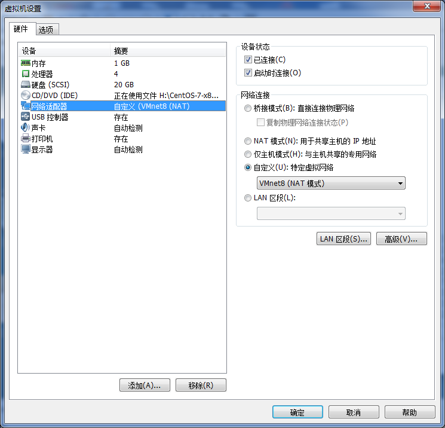
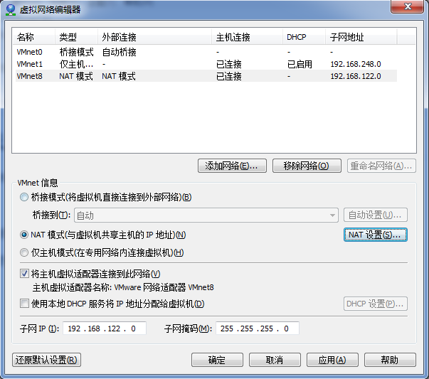
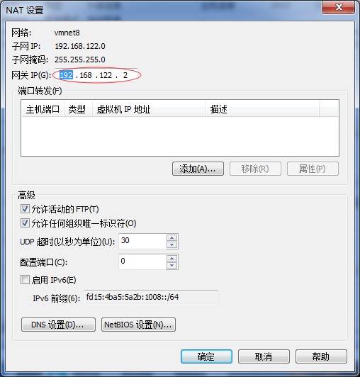
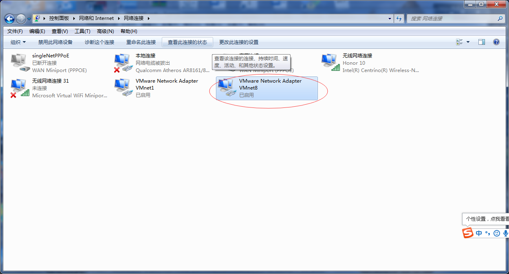
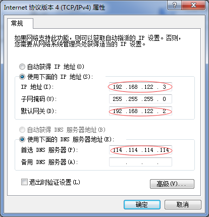
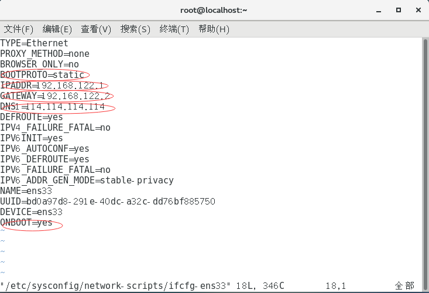
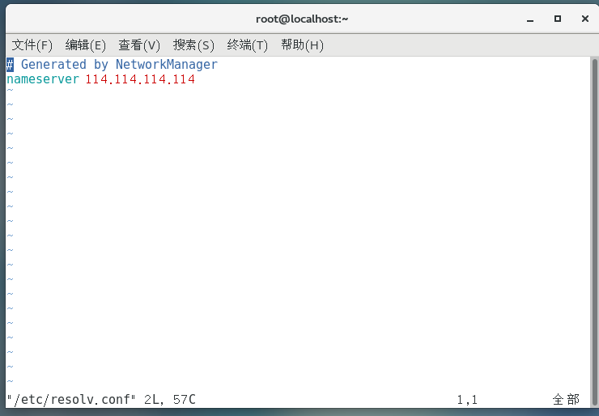

[TOC]

## Centos中遇到的一些问题

## 1、固定IP

先查看本地网卡：

~~~
# ifconfig
~~~

查看第一个网卡名称，我的是**ens33**,然后打开网卡配置文件

~~~
# vim etc/sysconfig/network-scripts/ifcfg-ens33
~~~

修改**BOOTTPROTP**和**IPADDR**，IPADDR就是自己想设置的固定IP

~~~
BOOTTPROTP=STATIC
IPADDR=192.168.254.144
~~~

最后，重启网络

~~~
service network restart
~~~

## 2、无法上网或无法通过终端工具(mobaxterm)连接

**首先**，查看网络适配器，是否处于NAT模式

示例中选择的是VMnet8(NAT模式)。

**其次**，打开 虚拟机->编辑->虚拟网络编辑器，将VMnet8按下图所示配置完成后，点击NAT设置。

NAT设置如下图，主要设置网关，前3位与子网前3位保持一致(192.168.122)，最后一位为.2。

**接着**，设置主机中的网络适配器，如图，选择VMnet8对应的适配器，右击属性。

对网络协议4进行修改，如下图，需要注意的是主机IP地址(即下图中的)与linux中的使用命令(ifconfig)所查出的IP不能一致。而网关则要与之前所设置的保持一致，并设置DNS。

查看第一个网卡名称，我的是**ens33**,然后打开网卡配置文件

~~~
# vim etc/sysconfig/network-scripts/ifcfg-ens33
~~~

在配置文件中，添加IPADDR(ifconfig查到的IP)、GATEWAY(设置的网关)和DNS1(设置的DNS)，并照下图修改BOOTPROTO和ONBOOT(是否激活网卡)

最后，打开配置文件resolv.conf以设置DNS,这是一个DNS客户机配置文件，用于设置DNS服务器的IP地址及DNS域名，关键字nameserver  -> 定义DNS服务器的IP地址。

