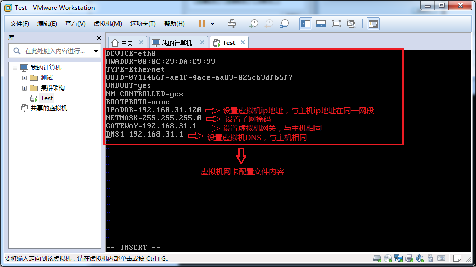
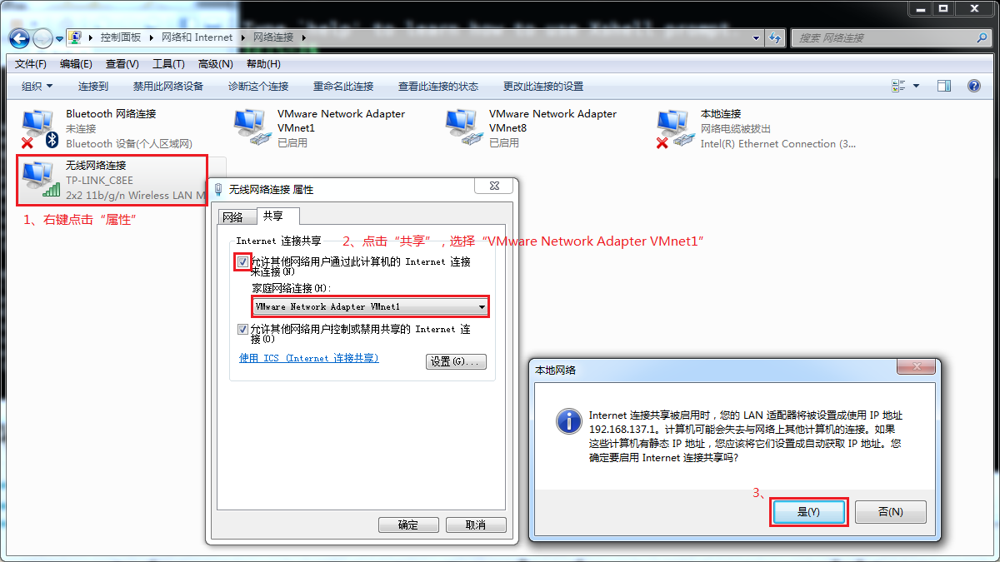

# 虚拟机网络模型

虚拟机VMware提供三种网络工作模式：Bridged(桥接模式)、NAT(网络地址转换模式)和Host-Only(仅主机模式)  

## 桥接模式

桥接模式将主机网卡与虚拟机虚拟的网卡利用虚拟网桥进行通信。在桥接的作用下，类似于把物理主机虚拟为一个交换机，所有桥接设置的虚拟机连接到这个交换机的一个接口上，物理主机也同样插在这个交换机当中，所以所有桥接下的网卡与网卡都是交换模式的，相互可以访问而不干扰。在桥接模式下，虚拟机IP地址需要与主机在同一个网段，如果需要联网，则网关与DNS需要与主机网卡一致。缺点是与主机同一网段的IP有限，不能设置太多的虚拟机。

在linux中进行设置时，虚拟机IP需与主机IP在同一网段，而网关和DNS与主机相同。

## NAT模式

NAT模式是将主机网卡直接与虚拟NAT设备相连，并在主机上设置虚拟网卡VMnet8，且将其虚拟为交换机，然后虚拟NAT设备与虚拟DHCP服务器一起连接在虚拟交换机VMnet8上，这样就实现了虚拟机联网。

在linux中进行设置时，虚拟机IP与主机虚拟网卡VMnet8的IP并不一致，但网关和DNS与其相同。虚拟网卡VMnet8的网关可以灵活设置。

## 仅主机模式

Host-Only是在NAT模式上去除了虚拟NAT设备，然后使用VMnet1虚拟网卡作为虚拟交换机进行通信，Host-Only模式将虚拟机与外网隔开，使得虚拟机成为一个独立的系统，只与主机相互通讯。

仅主机模式的虚拟机要与外网通信，需要将主机网卡共享给虚拟网卡VMnet1，并进行相应设置。

